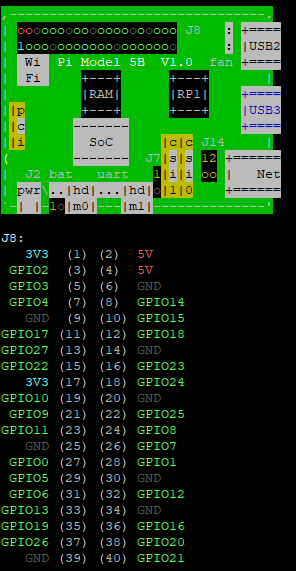

# 📡 iot-raspi-2025
라즈베리파이 이론 및 실습

## 1일차 - Raspberry Pi 환경 설정 및 기본 명령어 학습

### Raspberry Pi OS 설치 및 무선 설정 가이드 (Windows 기준)

### 1. Raspberry Pi Imager 다운로드 및 실행

- Raspberry Pi 공식 사이트 접속  
    - [https://www.raspberrypi.com/software/](https://www.raspberrypi.com/software/)

- **"Download for Windows"** 버튼 클릭하여 `.exe` 파일 다운로드

    

- 다운로드 완료 후 `.exe` 파일 실행

### 2. 설치 및 설정
1. **장치 선택**  
    - 사용하는 Raspberry Pi 모델 선택
2. **OS 선택**  
    - 원하는 Raspberry Pi OS 선택
3. **저장 장치 선택**  
    - 마이크로 SD 카드 선택

        

4. **설정 편집**
    - 라즈베리파이 디바이스, 운영체제, 저장소 설정 후 다음 클릭

    - OS 커스터마이징 설정을 적용
        - 설정을 편집하기 클릭

            

        - **Hostname**: 라즈베리파이의 네트워크 이름 지정  
        - **사용자 이름 및 비밀번호**: SSH 접속용 계정 설정  

        - **무선 네트워크 설정**
            - SSID : Wi-Fi 이름 입력 (공유기의 네트워크 이름 확인 후 입력)  
            - Password: Wi-Fi 비밀번호 입력  
            - 무선 LAN 국가 : `KR` (대한민국)

        - **로케일 설정**
            - 키보드 레이아웃: `kr`  
            - 언어/지역 설정: 한국어로 지정

        - **서비스**
            - SSH 활성화 체크 (원격 접속용)

5. 설정 후 ->  **저장** 클릭  -> 설치 진행


### 3. 공유기에서 Wi-Fi 정보 확인

- 웹 브라우저에서 `와이파이 IP` 접속
- 로그인 후 **[관리도구] → [무선랜 관리] → [Wi-Fi 기본설정]** 메뉴 이동
- **네트워크 이름 (SSID)** 및 **비밀번호** 확인


### 4. 소프트웨어 추가 다운로드

#### VNC Viewer 다운로드 (원격 데스크탑 연결용)

- VNC Viewer 공식 다운로드 페이지
    - [https://www.realvnc.com/en/connect/download/viewer/](https://www.realvnc.com/en/connect/download/viewer/)

- 사용 중인 OS(예: Windows)에 맞는 설치 파일 다운로드

#### SD Card Formatter 다운로드 (SD 카드 초기화용)

- SD 카드 포맷 공식 유틸리티
    - [https://www.sdcard.org/downloads/formatter/](https://www.sdcard.org/downloads/formatter/)
- Windows 또는 macOS용 다운로드 및 설치
- 마이크로 SD 카드 삽입 후 포맷 진행 (옵션: Quick Format 추천)

### 5. Raspberry Pi VNC 원격 접속 설정

#### SSH 접속 (PuTTY 사용)

1. **PuTTY 실행**  
2. Host Name에 **라즈베리파이 IP 주소 입력**  
    - 예: `192.168.0.xxx`
3. Port는 기본값 `22`, 연결 타입 `SSH`로 설정 후 `Open` 클릭  
4. 로그인 화면에서 다음 입력:
   - ID: `pi`  
   - Password: (설치 시 설정한 비밀번호)

#### VNC 기능 활성화

- SSH 접속 완료 후 명령어 입력

```bash
sudo raspi-config
```

1. Interface Options 선택

    

2. VNC 선택

    

3. Would you like the VNC Server to be enabled?
    - Yes 클릭 후 Finish 후 종료
    
4. 라즈베리파이 재시작

```bash
sudo reboot 
```

####  VNC Viewer로 원격 접속
- VNC Viewer 실행 -> 주소창에 라즈베리파이 IP 주소 입력 -> 사용자 이름과 비밀번호 입력

#### 한글 폰트 설치 및 등록

```bash
sudo apt install fonts-nanum fonts-nanum-extra  // 나눔폰트 설치
sudo apt install fonts-unfonts-core             // 폰트등록
sudo reboot now
```

#### 한글 입력기 설치
- 메뉴 -> 기본설정 -> 입력기 -> default 변경 후 확인

    

- VNC Viewer -> 터미널 -> 해당 명령어 실행

```bash
sudo apt install fcitx-hangul
```

#### Nano 설정 (`/etc/nanorc`)

- VNC Viewer -> 터미널 -> 해당 명령어 실행

```bash
sudo nano /etc/nanorc
```

- 주석 제거 항목
    - `set autoindent` : 새 줄 입력 시 이전 줄의 들여쓰기를 자동 복사하여 유지.\
    - `set linenumbers` : 편집 화면 왼쪽에 줄 번호를 표시
    - `set tabsize 3` : 탭 입력 시 들여쓰기 칸 수를 지정. 기본값 8칸 -> 3칸으로 줄임

### 🈶 한글 폰트 설치

```bash
sudo apt install fonts-nanum fonts-nanum-extra      # 나눔폰트 설치
sudo apt install fonts-unfonts-core                 # 한글 폰트 등록
```

### 기본 명령어
#### 📁 디렉토리 관련 명령어

| 명령어 | 설명 |
|--------|------|
| `pwd` | 현재 디렉토리 경로 출력 |
| `cd [디렉토리]` | 지정한 디렉토리로 이동 |
| `cd ..` | 상위 디렉토리로 이동 |
| `cd` 또는 `cd ~` | 홈 디렉토리(`/home/pi`)로 이동 |
| `.` | 현재 디렉토리를 의미 |
| `..` | 상위 디렉토리를 의미 |
| `ls` | 현재 디렉토리의 파일/폴더 목록 출력 |
| `ls -l` | 상세 정보와 함께 출력 |
| `ls -a` | 숨김 파일 포함 전체 목록 출력 |

---

#### 📂 파일 및 폴더 관리 명령어

| 명령어 | 설명 |
|--------|------|
| `mkdir [폴더명]` | 새 폴더 생성 |
| `rmdir [폴더명]` | 비어있는 폴더 삭제 |
| `rm [파일명]` | 파일 삭제 |
| `rm -r [폴더명]` | 폴더와 그 안의 내용 모두 삭제 |
| `cp [원본] [대상]` | 파일 복사 |
| `mv [원본] [대상]` | 파일 이동 또는 이름 변경 |

---

#### ⚙️ 시스템 관련 명령어

| 명령어 | 설명 |
|--------|------|
| `sudo` | 관리자 권한으로 명령 실행 |
| `sudo reboot` | 시스템 재부팅 |
| `sudo shutdown now` | 즉시 시스템 종료 |
| `sudo shutdown -r now` | 즉시 재부팅 |
| `top` | 현재 실행 중인 프로세스 보기 |
| `htop` | 리소스 상태 확인 (시각적, 설치 필요) |

---

#### 📦 패키지 관리 명령어 (APT)

| 명령어 | 설명 |
|--------|------|
| `sudo apt update` | 패키지 목록 업데이트 |
| `sudo apt upgrade` | 설치된 패키지 업그레이드 |
| `sudo apt install [패키지명]` | 새 패키지 설치 |
| `sudo apt remove [패키지명]` | 패키지 제거 |
| `sudo apt autoremove` | 사용하지 않는 패키지 자동 제거 |

---

#### 🌐 네트워크 관련 명령어

| 명령어 | 설명 |
|--------|------|
| `hostname -I` | IP 주소 확인 |
| `ping [주소]` | 네트워크 연결 확인 |
| `ifconfig` 또는 `ip a` | 네트워크 상태 확인 |

---

#### 🛠 기타 유용한 명령어

| 명령어 | 설명 |
|--------|------|
| `clear` | 터미널 화면 지우기 |
| `nano [파일명]` | 간단한 텍스트 편집기 |
| `cat [파일명]` | 텍스트 파일 내용 출력 |
| `chmod +x [파일명]` | 실행 권한 부여 |
| `./[파일명]` | 현재 디렉토리에서 파일 실행 |

---


## 2일차 - LED 및 스위치 연결

### rasberrypi board 구조



---

## ⚙️ RPI.GPIO 모듈 기본 사용법

| 명령어                          | 설명 |
|----------------------------------|------|
| `GPIO.setmode(GPIO.BOARD)`      | 보드의 물리적 핀 번호 기준 (1~40) |
| `GPIO.setmode(GPIO.BCM)`        | BCM GPIO 번호 기준 (예: GPIO 2, 3 등) |
| `GPIO.setup(pin, GPIO.OUT)`     | 지정 핀을 출력 모드로 설정 |
| `GPIO.setup(pin, GPIO.IN)`      | 지정 핀을 입력 모드로 설정 |
| `GPIO.output(pin, GPIO.HIGH)`   | 지정 핀에 전압 인가 (1 또는 True) |
| `GPIO.output(pin, GPIO.LOW)`    | 지정 핀에 전압 차단 (0 또는 False) |
| `GPIO.input(pin)`               | 입력 핀의 상태 읽기 (HIGH 또는 LOW) |
| `GPIO.cleanup()`                | 사용한 핀 초기화 (반드시 종료 시 호출) |

---       

## ⚡ 풀업 저항 vs 풀다운 저항

- **풀업 저항 (Pull-up)**: 입력 핀을 **기본적으로 HIGH(1)** 상태로 유지  
- **풀다운 저항 (Pull-down)**: 입력 핀을 **기본적으로 LOW(0)** 상태로 유지  
- 스위치 연결 시 핀 상태의 안정성을 위해 사용  
- 라즈베리파이에서는 내부 풀업/풀다운 저항을 소프트웨어로 설정 가능  
  ```python
  GPIO.setup(pin, GPIO.IN, pull_up_down=GPIO.PUD_UP)
  GPIO.setup(pin, GPIO.IN, pull_up_down=GPIO.PUD_DOWN)
  ```

### LED 및 스위치 연결 실습

#### LED 연결
- LED를 라즈베리파이 GPIO 핀에 직접 연결
- 저항을 직렬로 연결하여 전류 제한

- [코드보기](./day02/led.py)

#### LED + 스위치 연결
- 스위치 연속 입력을 통해 LED ON/OFF 제어
    - 1번 : OFF
    - 2번 : RED
    - 3번 : GREEN
    - 4번 : BLUE
    - 그외 : OFF
- 내부 풀업 저항 사용 예제 포함
- [코드보기](./day02/buttonled.py)


## 3일차 - 온습도 센서 데이터 DB 연동

### 1. 온습도 센서 데이터 
- DHT11 센서를 사용하여 라즈베리파이에서 온도 및 습도 데이터를 측정
- `adafruit-circuitpython-dht` 라이브러리를 활용하여 센서 제어 및 데이터 읽기를 수행
- [코드보기](./day03/dhtllSensor.py)

    

### 2. DB 연동 
- 측정된 온습도 데이터를 MariaDB(MySQL)에 실시간 저장
- Python에서 `mysql-connector-python` 라이브러리를 사용해 MariaDB와 연동
- [코드보기](./day03/dhtllDB.py)

### 3. 환경설정
#### 3.1 가상환경 활성화(env)

```bash
source env/bin/activate
```

#### 3.2 필요한 라이브러리 설치

``` bash
pip install adafruit-circuitpython-dht
pip install mysql-connector-python
sudo apt install libgpiod2
```

### 4. MariaDB 설정

#### 4.1 MariaDB 접속 (root 권한)

``` bash
sudo mysql
```

#### 4.2 데이터베이스 및 테이블 생성
```sql
CREATE DATABASE iotdb;
USE iotdb;

CREATE TABLE dhtll (
    id INT AUTO_INCREMENT PRIMARY KEY,
    temperature FLOAT NOT NULL,
    humidity FLOAT NOT NULL,
    timestamp DATETIME DEFAULT CURRENT_TIMESTAMP
);
```

#### 4.3 사용자 생성 및 권한 부여
```sql
CREATE USER 'raspi'@'localhost' IDENTIFIED BY 'raspi';
GRANT ALL PRIVILEGES ON iotdb.* TO 'raspi'@'localhost';
FLUSH PRIVILEGES;
```

### 5. Python 코드 개요(dhtll.py)
- dhtll 센서 데이터 일기
- MariaDB에 온습도 데이터 저장
- 예외 처리 및 자원 정리 포함

### 6. 실행 및 데이터 확인
#### 6.1. python 스크립트 실행

```bash
python dhtllDB.py
```

#### 6.2. MariaDB에서 데이터 확인
```bash
mysql -u raspi -p   // MariDB에 raspi 사용자로 접속
```

```sql
USE iotdb;
SELECT * FROM dhtll ORDER BY id DESC LIMIT 10;
```


### 7. 추가 팁
- 저장 주기를 조절하려면 time.sleep()의 값을 변경
- 필요에 따라 데이터 시각화, 웹 연동 등의 확장도 고려


## 4일차   

### pyqt

### 환경설정 
1. PyQt5 설치
```bash
sudo apt install python3-pyqt5
```
2. Qt Designer 및 개발 도구 설치
```bash
sudo apt install qttools5-dev-tools
```
---

## 5일차 : PWM 제어 실습

라즈베리파이의 GPIO와 PWM을 이용해 피에조 부저를 제어하고,
RGB LED 및 버튼, 키보드 입력을 활용한 다양한 응용 예제

### PWM 제어(Pulse Width Modulation) - 펄스 폭 변조
: 디지털 신호의 펄스 폭을 조절하여 아날로그 제어 효과를 얻는 기술

- 피에조 부저 : 압전 효과를 이용하여 소리를 내는 부저의 한 종류

---

### 1. 멜로디


- 기본음(도레미...) [`buzzer_melody.py`](./day05/buzzer_melody.py) - 주파수에 따라 기본 음계 출력
- 작은별(Twinkle) [`buzzer_twinkle.py`](./day05/buzzer_twinkle.py) - '작은 별' 멜로디 재생
- 마리오(Super Mario) [`buzzer_mario.py`](./day05/buzzer_mario.py) - 마리오 테마곡
- 사이렌(Siren) [`buzzer_siren.py`](./day05/buzzer_siren.py) - 경고 사이렌 효과

### 2. 사이렌 + RGB LED 깜빡임 + 버튼 입력
버튼을 누르면 사이렌 소리와 함께 RGB LED가 깜빡임
[`buzzerLedBtn_siren.py`](./day05/buzzerLedBtn_siren.py)


### 3. 키보드 입력으로 도레미 연주
PC 키보드 입력을 통해 도레미파솔라시도 음을 출력
[`buzzerMel_Kboard.py`](./day05/buzzerMel_Kboard.py)

---

## 6일차: 릴레이 제어 & 인터럽트 처리

릴레이를 활용한 전기 회로 제어와, 인터럽트를 이용한 효율적인 이벤트 처리 방법

### 릴레이 회로

: 릴레이는 전자석을 이용해 외부 전기 신호로 회로를 개폐하는 전자식 스위치  
전류가 흐르면 내부의 접점이 물리적으로 전환되어 외부 회로를 제어할 수 있음

- **접점 종류**
  - **NO (Normally Open)**: 평소에는 열려 있다가 동작 시 닫힘
  - **NC (Normally Closed)**: 평소에는 닫혀 있다가 동작 시 열림
  - **COM (Common)**: NO/NC와 연결되는 공통 단자

▶ [`relayTest.py`](./day06/relayTest.py)

### 인터럽트 (Interrupt)

인터럽트는 외부(또는 내부)에서 특정 이벤트가 발생했을 때  
현재 실행 중인 코드 흐름을 잠시 멈추고, 해당 이벤트를 처리하는 **콜백 함수**를 자동으로 호출하는 메커니즘

- 이벤트 기반의 효율적인 처리 방식
- 반복문 없이도 빠른 반응 구현 가능

▶ [`interrupt.py`](./day06/interrupt.py)

### 인터럽트를 활용한 LED 제어

버튼 인터럽트를 활용하여 LED를 ON/OFF로 제어
이 방식은 polling 없이 즉각적인 반응을 구현할 수 있어 효율적임

▶ [`interruptLED.py`](./day06/interruptLED.py)


## 7일차

### 로그인 프로그램

### web flask


## 8일차

### 사용자 정보 저장 페이지